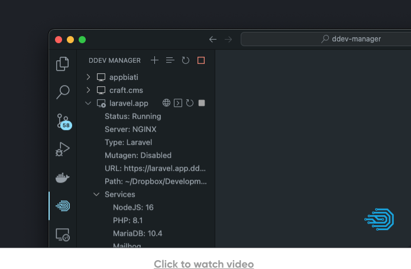

# DDEV Manager

VS Code extension to manage DDEV. This extension will help you to manage DDEV without the need to open the terminal, run commands, etc. You can manage all your projects directly from vscode.

## Features

- Start/Stop/Restart projects
- Stop all projects except the selected one
- Delete projects
- Change Services versions (PHP, NodeJS, etc.)
- Automatically configure the PHP version in the editor. Used for providing version appropriate suggestions and diagnostics. It required a extension like PHP Intelephense or PHP by DEVSENSE
- Integrated DDEV terminal
- Create/Restore/Clear Snapshots
- Quickly launch projects in your browser
- Open the database with any application you want (PHP MyAdmin, TablePlus, Sequel Ace, etc.)
- Quickly open the Config.yaml file
- Poweroff DDEV
- Reveal DDEV projects in your OS file explorer
- Manage all your projects directly from the sidebar
- Change sidebar view to list all projects or only the project for the active workspace
- And much more...

## Roadmap

- Create/Edit projects visually
- Export/Import database
- Enable/Disable XDebug
- Add/Remove services
- Share
- Notify DDEV updates and self upgrade

## Requirements

- You must have DDEV already installed and working.
